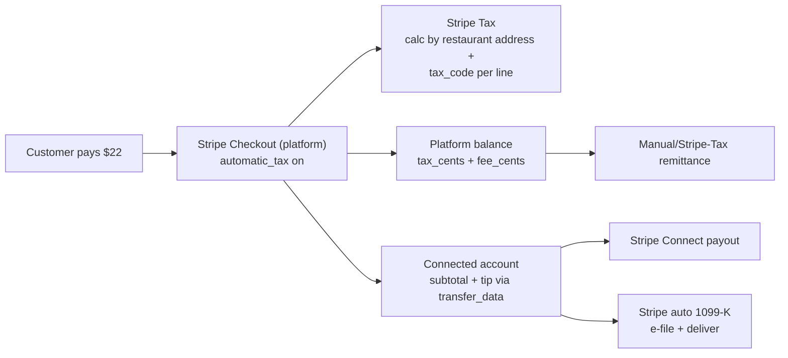

## Rasvia Stripe Tax + Marketplace Facilitator Implementation Plan

### Architectural decisions (confirmed)

- Rasvia is the **Marketplace Facilitator / seller-of-record**. Stripe Tax runs
  on the platform Checkout Session; tax stays on the platform balance for us to
  remit.
- Fund flow stays on **Destination Charges** (`transfer_data.destination`), but
  we switch to transferring a **computed amount** (`subtotal_cents + tip_cents`)
  instead of the full total, so tax and future platform fees remain on Rasvia's
  balance.
- Add **per-restaurant platform-fee plumbing** now, but default the rate to 0 so
  behavior is unchanged until we flip it on.
- Rasvia is dine-in / takeout / group dining (not delivery) — the taxable
  location is the **restaurant's address**, so the tax engine must be primed
  with the restaurant's street/city/state/postal, and each menu item needs a
  prepared-food tax code.

---

### High-level flow (after implementation)



---

### Phase 1 — Database schema

New migration `supabase/migrations/<ts>_marketplace_facilitator_tax.sql`:

- `restaurants`:
  - `street_address text`, `city text`, `state text`, `postal_code text`,
    `country text default 'US'` (only add columns that are missing; many
    installs already collect these)
  - `platform_fee_bps integer not null default 0` (basis points; 0 = no fee)
  - `tax_profile text not null default 'platform_facilitator' check (tax_profile in ('platform_facilitator','seller_of_record'))`
    — leaves the door open for the hybrid case later
- `menu_items`:
  - `stripe_tax_code text not null default 'txcd_40060003'` (Prepared Food).
    Non-prepared SKUs (e.g. sealed beverages, packaged grocery) can override via
    the menu editor.
- `orders`:
  - `tax_cents integer not null default 0`
  - `platform_fee_cents integer not null default 0`
  - `stripe_tax_calculation_id text`
  - `stripe_tax_transaction_id text`
  - `transfer_amount_cents integer` (what we actually sent to the restaurant;
    for audit)
- `party_payments` (v2): mirror `tax_cents`, `platform_fee_cents`,
  `stripe_tax_transaction_id`
- `party_sessions`: already has `tax_cents` — start populating it from Stripe
  Tax instead of leaving it 0.

### Phase 2 — Stripe Connect onboarding for 1099-K

Update
[RasviaWeb/supabase/functions/create-stripe-account/index.ts](RasviaWeb/supabase/functions/create-stripe-account/index.ts):

```ts
const account = await stripe.accounts.create({
    type: "express",
    capabilities: {
        card_payments: { requested: true },
        transfers: { requested: true },
        tax_reporting_us_1099_k: { requested: true },
    },
    business_profile: { name: restaurantData.name || "Rasvia Partner" },
    settings: {
        payouts: { schedule: { interval: "daily" } },
    },
});
```

- Add a check in
  [check-stripe-status](RasviaWeb/supabase/functions/check-stripe-status/index.ts)
  that also returns `tin_collected`, `1099_status`, and
  `requirements.currently_due` so the partner portal can prompt for W-9/TIN
  completion.
- Gate "Accept first order" in
  [StripeConnect.tsx](RasviaWeb/src/components/dashboard/StripeConnect.tsx) on
  tin/details_submitted, not just `payouts_enabled`.
- In Stripe Dashboard → Connect → Tax forms, set the platform to **e-file and
  deliver 1099-K on behalf of connected accounts**.

### Phase 3 — Stripe Tax setup (dashboard, not code)

One-time platform setup steps the user/CPA runs:

- Enable Stripe Tax.
- Register as Marketplace Facilitator in every state where we have nexus; attach
  Tax Registrations in the dashboard.
- Verify Product Tax Code assumptions: confirm `txcd_40060003` (Prepared Food)
  is the correct default for our menu category; map alcohol / packaged goods
  overrides per state if present.
- Keep a `RasviaWeb/docs/tax-registrations.md` checklist so future CPAs can see
  where we're registered.

### Phase 4 — Rewrite `create-checkout` (both repos, keep in sync)

Touch both
[Rasvia1/supabase/functions/create-checkout/index.ts](Rasvia1/supabase/functions/create-checkout/index.ts)
and
[RasviaWeb/supabase/functions/create-checkout/index.ts](RasviaWeb/supabase/functions/create-checkout/index.ts).
Changes apply to all three flows (solo, party v2, legacy v1):

Line-item construction: instead of a single rolled-up
`unit_amount: Math.round(subtotal * 100)`, build **one Stripe line item per cart
item** so Stripe Tax can apply the right tax code:

```ts
line_items: orderItems.map((item) => ({
  price_data: {
    currency: 'usd',
    tax_behavior: 'exclusive',
    product_data: {
      name: item.name,
      tax_code: item.stripe_tax_code ?? 'txcd_40060003',
    },
    unit_amount: Math.round(item.price * 100),
  },
  quantity: item.quantity,
})),
```

Enable Stripe Tax and prime the location with the restaurant's address
(origin-based sourcing for prepared food):

```ts
automatic_tax: { enabled: true },
customer_creation: 'if_required',
billing_address_collection: 'required',
tax_id_collection: { enabled: false },
payment_intent_data: {
  transfer_data: {
    destination: stripeAccountId,
    amount: subtotalCents + tipCents, // tax + fee stay on platform
  },
  application_fee_amount: Math.round((subtotalCents * restaurant.platform_fee_bps) / 10000),
  on_behalf_of: undefined, // DO NOT set — keeps platform as seller
  metadata: { /* existing */ },
},
metadata: {
  ...existingMetadata,
  restaurant_id: String(restaurantId),
  tax_facilitator: 'platform',
},
```

Notes:

- For party v2, the current flow charges `paymentRow.amount_cents` (a pre-split
  bucket). Replace that single-amount line item with the member's share of the
  actual party line items, driven by the same split logic that sits in `party_*`
  RPCs, so tax is computed per line and not on a flat number.
- For dine-in we still pass the customer's billing address on the Checkout
  Session (that's what Stripe Tax requires); Stripe's origin/destination
  sourcing then uses the restaurant address we also pass via `metadata` + tax
  configuration.
- Keep `application_fee_amount = 0` when `platform_fee_bps = 0` — the code path
  is plumbed but inert.

### Phase 5 — Webhook persistence + tax transaction booking

Update
[stripe-webhook/index.ts](Rasvia1/supabase/functions/stripe-webhook/index.ts)
(and RasviaWeb copy) inside `handleCheckoutCompleted`:

- Retrieve the full session with tax expanded:
  ```ts
  const full = await stripe.checkout.sessions.retrieve(session.id, {
      expand: ["total_details.breakdown", "payment_intent.latest_charge"],
  });
  ```
- Persist on the order row:
  - `tax_cents = full.total_details?.amount_tax ?? 0`
  - `platform_fee_cents = full.payment_intent?.application_fee_amount ?? 0`
  - `transfer_amount_cents = full.payment_intent?.transfer_data?.amount`
  - `stripe_tax_calculation_id = full.automatic_tax?.liability?.tax_calculation_id`
    (if exposed; otherwise read from `tax.transactions.create_from_calculation`
    response below)
- **Book the tax transaction** (required for Stripe Tax to include this sale in
  our filings/exports) by calling
  `stripe.tax.transactions.createFromCalculation` if the Checkout Session didn't
  auto-book it. Store `stripe_tax_transaction_id`.
- Mirror the same fields onto `party_payments` via a new `p_tax_cents` /
  `p_platform_fee_cents` arg on `party_settle_payment`.

### Phase 6 — Replace hardcoded 8.25% tax in the POS

Affected files in RasviaWeb:

- [src/context/DashboardContext.tsx](RasviaWeb/src/context/DashboardContext.tsx)
  — delete `TAX_RATE = 0.0825`, `recalcOrderTotals`, and the three in-memory
  recomputation sites (void/discount/etc.); replace with a small helper that
  calls a new `calculate-tax` Edge Function backed by
  `stripe.tax.calculations.create`.
- [src/components/pos/POSTerminal.tsx](RasviaWeb/src/components/pos/POSTerminal.tsx)
  — remove `TAX_RATE`, read `tax` directly from the order / live calculation.
- [src/components/pos/Receipt.tsx](RasviaWeb/src/components/pos/Receipt.tsx) —
  show the Stripe-calculated tax breakdown (incl. jurisdiction label if
  available).

The new `calculate-tax` Edge Function takes
`{ restaurant_id, line_items, customer_address? }` and returns
`{ amount_total, amount_tax, calculation_id, breakdown }`. Cash orders in the
POS finalize with `stripe.tax.transactions.createFromCalculation` to stay inside
Stripe Tax reporting even though no Stripe payment ran.

### Phase 7 — Partner dashboard surfaces

In [StripeConnect.tsx](RasviaWeb/src/components/dashboard/StripeConnect.tsx) and
a new "Tax & Forms" tab under admin portal:

- W-9 / TIN collection status (from `check-stripe-status`)
- Platform fee rate (admin-only editor for `platform_fee_bps`)
- Link to the Stripe Express dashboard section where the partner sees their
  1099-K when issued
- Year-to-date totals: `subtotal`, `tax_collected_by_platform`, `platform_fees`,
  `net_payouts`

### Phase 8 — Tests + safety nets

- Extend the existing "never trust client amounts" checks in `create-checkout`
  so that `tax_cents` and `platform_fee_cents` are **also** derived server-side
  (from Stripe's calculation response, not from any client field).
- Add an integration test hitting Stripe test mode that asserts: (a) tax appears
  on the session, (b) `transfer_data.amount` equals `subtotal + tip`, (c)
  `application_fee_amount` matches `platform_fee_bps`.
- Add a migration guard: reject checkout if `restaurants.state` or `postal_code`
  is null — we cannot compute tax without an origin.

### Out of scope for this iteration

- Turning on an actual platform fee percentage (columns are added, value stays
  0).
- Hybrid restaurants-as-seller-of-record (`tax_profile = 'seller_of_record'`) —
  the column is there but the code path is platform-facilitator-only.
- International tax (VAT/GST) — all scaffolding is US-first.

### Required user / ops follow-ups (non-code)

- Consult a CPA to confirm marketplace facilitator nexus and Stripe Tax
  registrations in each state.
- Enable Stripe Tax + Marketplace Facilitator settings in the Stripe Dashboard.
- Configure Connect → Tax forms to "e-file and deliver 1099-K on behalf of
  connected accounts."
- Update `AGENTS.md` in both repos with the new invariants: (1) Stripe is the
  only source of truth for tax, (2) `transfer_data.amount` must equal
  `subtotal + tip`, (3) `platform_fee_bps` is the only knob for our take rate.
